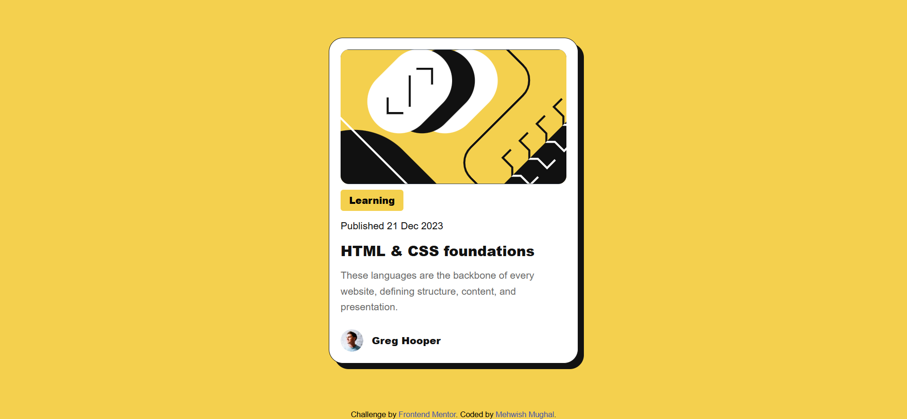

# Blog-Preview-Card
# Frontend Mentor - Blog preview card solution

This is a solution to the [Blog preview card challenge on Frontend Mentor](https://www.frontendmentor.io/challenges/blog-preview-card-ckPaj01IcS). Frontend Mentor challenges help you improve your coding skills by building realistic projects. 

## Table of contents

- [Overview](#overview)
  - [The challenge](#the-challenge)
  - [Screenshot](#screenshot)
  - [Links](#links)
- [My process](#my-process)
  - [Built with](#built-with)
  - [What I learned](#what-i-learned)
  - [Continued development](#continued-development)
  - [Useful resources](#useful-resources)
- [Author](#author)
- [Acknowledgments](#acknowledgments)


## Overview

This project is a solution to the Blog Preview Card challenge from Frontend Mentor. The goal of this challenge was to build a responsive card component and practice hover and focus states using HTML and CSS.

### The challenge

Users should be able to:

- See hover and focus states for all interactive elements on the page and the responsiveness of the card component.

### Screenshot




### Links

- Solution URL: (https://your-solution-url.com)
- Live Site URL:(https://your-live-site-url.com)

## My process

First, I completed the HTML structure, and then I styled the component using CSS. The focus was on ensuring that users can see hover and focus states for all interactive elements, as well as maintaining responsiveness across different screen sizes.

“Accessibility was tested using Chrome Lighthouse.”

Improved text contrast to meet WCAG accessibility standards for better readability.

### Built with

- Semantic HTML5 markup
- CSS custom properties
- CSS hover & focus states
- Flexbox
- Responsive Card Component

### What I learned

Through this project, I practiced my basic understanding of HTML and CSS by applying them in a real task. I also learned the importance of hover and focus states for all interactive elements on the page and responsiveness of card component.

Additionally, I learned how to:
- Manage files effectively in the VS Code editor
- Create and structure a Markdown (README.md) file
- Understand and follow Figma designs for professional learning and growth

```css 
.blog{
    background-color:hsl(0, 0%, 100%);
    width:90%;
    max-width: 22rem;
    padding: 1rem;
    border-radius: 1.25rem;
    margin:0 auto; 
    border: 1px solid hsl(0, 0%, 7%);
    box-shadow: 8px 8px 0 hsl(0, 0%, 7%);      
}
```


### Continued development

In future projects, I want to continue improving my HTML and CSS skills, especially in building more responsive layouts. I plan to practice Flexbox more and start learning CSS Grid for more complex layouts.

I also aim to:

-Write cleaner and more maintainable code
-Improve accessibility practices
-Gain more confidence in understanding Figma design files
-Strengthen my workflow using Git and GitHub
-Gradually move toward JavaScript to add interactive features


### Useful resources

- [GitHub](https://github.com/EngrMehwishMughal/QR-CODE-COMPONENT-MAIN) - > This project helped me in developing the Blog Preview Card component and understanding project structure.
- [ChatGPT](https://chatgpt.com) - This tool supported me like a mentor and guided me whenever I got stuck. 


## Author

- Website - [Add your name here](https://www.your-site.com)
- Frontend Mentor - [@EngrMehwishMughal](https://www.frontendmentor.io/profile/EngrMehwishMughal)

## Acknowledgments

I would like to express my sincere gratitude to Frontend Mentor for inspiring me to participate in these challenges and helping me regain confidence. After many unsuccessful attempts in the past, these challenges motivated me to keep going, improve my skills, and not give up. This journey has been a valuable and encouraging learning experience for me.

